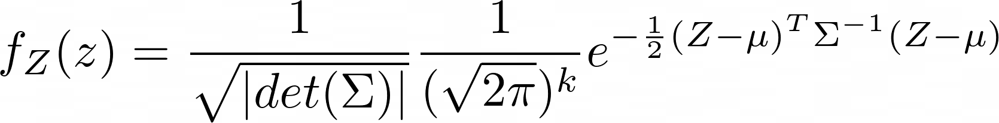

# Crowder: COVID Risk Visualization
Have you ever needed to go somewhere, except you're not sure how safe it is, during these dark times of Covid? Well we have...

We present **Crowder**, an app which visualizes how risky particular locations are, in terms of catching Covid. The app relies on crowd contribution, so the more users using the app the more accurate it is.

## Risk scalar field
> "Aren't we all just Gaussian curves, walking around, screwing each other's brains out?"
> Ongo Gablogian

We compute a positively valued scalar field over the world map (2D plane). The scalar value at a particular point in the field is the covid risk level associated with that particular location, i.e. how risky is it to be at that location.

Each entity in the system (users) is represented as a 2D gaussian curve centered at their current location. This means they are small 'bumps' on the risk field, so it is riskier to be near other users. This represents social distancing.

The scalar field is then the sum of all the gaussian curves in the system. As users move around, this scalar field changes to reflect their new positions.

However, we understand that covid can linger on surfaces which can cause retroactive spreading. To model this, we also factor in the older risk fields, scaled so that older ones have a smaller impact than newer ones. Essentially, users leave a trail of 'risk' walking around.

The equations we used are presented below for interested parties.

### Some Equations

<!--  -->

The default Gaussian function is given by the function below, for the general N-dimensional case.

>&space;=&space;\frac{1}{\sqrt{|det(\Sigma)|}}&space;\frac{1}{(\sqrt{2\pi})^k}&space;e^{-\frac{1}{2}&space;(x&space;-&space;\mu)^T\Sigma^{-1}&space;(x&space;-&space;\mu)&space;})

We are interested in the 2-D case ) where  and .

-  is the center of the curve, therefore it is the location of the entity on the map.

-  is any location on the map we are trying to check the risk level for.

-  is the covariance matrix which represents the shape of the curve (rotation, how wide it's range). This is to be determined based on social distancing guidelines, and will be the same for every person.

We multiply the default gaussian function by  to get &space;=&space;1) , which means a person is carrying around a risk value of 1 with them (for simplicity).

Every few seconds, each user will ping the server with it's new location . We store each ping along with a timestamp that's used to calculate the decay factor. The risk field is then computed as the decayed sum of gaussian functions associated with each ping:

>=\sum_i&space;decay_i&space;\cdot&space;f_{\mu_i,\Sigma_i}(x))

The decay is an exponential decay from the time the ping was first detected (hence the timestamping). The exact exponential decay model is taken from this [SARS calculator](https://www.dhs.gov/science-and-technology/sars-calculator).

## Backend Server

### user table
keeps track of the list of users in the system
| uuid|
|:---:|
|  0  |
|  1  |

### locations table
keeps track of location pings, which is used to compute the risk scalar field.
Users can move around, so their lat, long can change. The timestamp is used to calculate decay (how fresh & relevant the ping is). See formula below for details.

| userid  |    lat    |   long | timestamp  |
|:-------:|:---------:|:------:|:----------:|
|  0      |20.0934    |30.2823 |    0       |
|  1      |-40.2383   |15.3453 |    0       |

### REST API
#### New User
New user creation
* POST /new_user
* Body
```
{
    userID (string)
}
```
* Return
```
{
  riskLevel (double[0, 1])
}
```

#### Get Risk Level
* POST /risk_level
* Body
 ```
 {
     userID (string),
     lat (double),
     long (double)
 }
 ```
* Return
```
{
    riskLevel (double [0, 1])
}
```

#### Insert a new location ping into the server
* POST /new_location
* Body
```
{
    userID,
    lat,
    lng,
    timestamp
}
```

## Frontend App
<!-- TODO: fill this in, explain the user interface -->

## Challenges
* Heroku does not support sqlite3 so we had to switch over to postgresql which we have never used before
* We did not get the expected behavior from our formula - you will constantly increase your risk level around you because decay is too slow to counteract the covid "trail" effect
* Trying not to overwork - and failing miserably

## Accomplishments
*  We deployed a functioning backend with a REST API
*  Creating a risk evaluation algorithm from scratch - and simplified it to make it feasible for tracking

## What we learnt
* We learnt the Heroku framework for deploying a backend application
* We learnt about Teletype for working on code together, which made things faster and simpler
* We learnt about Flask-Restful and how to create a RESTful API using Python

## What's next for CROWDER
* Heatmap to actually visualize risk on the map
* Reminders based on user activity and risk levels surrounding them (behavior analysis)
* Turn it into a social game to actually motivate users
* Collect anonymized user data in order to aid in actual Contact Tracing efforts

<!--
TODO: fill in these sections for front end
## How we built it
## Challenges
## Accomplishments that I'm proud of
## What we learned
## What's next for CROWDER -->
